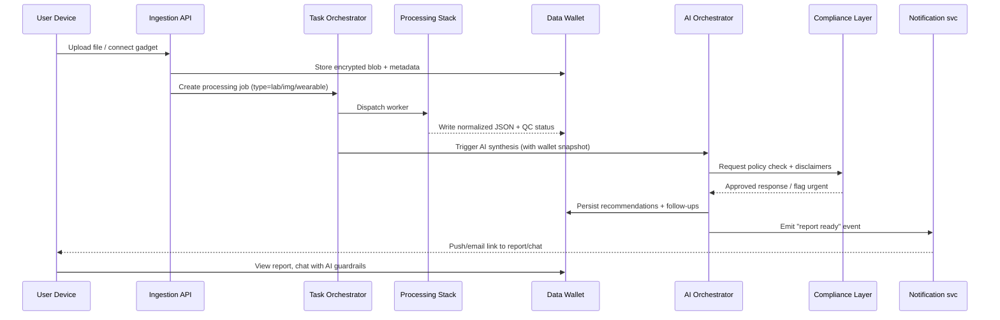

# Nutrition Intelligence Platform — Delivery Blueprint

## 1. System Architecture
- **Edge layer:** Web/mobile client handles uploads (PDF, CSV, JPG, DICOM), camera capture, gadget OAuth/BLE pairing. Traffic gated through API Gateway with mTLS, rate limits and WAF.
- **Ingress service:** `ingestion-service` accepts files/streams, fingerprints the source (heuristics + mini-LLM classifier), anonymizes PHI, writes encrypted blobs to `secure-object-store` (S3 compatible) and posts jobs to `Task Orchestrator` (Temporal or Airflow).
- **Processing services:**
  - `lab-parser` (Python/FastAPI) → OCR (DocTr/TrOCR) → unit normalization → mapping to `ReferenceRanges` service.
  - `imaging-pipeline` (Rust/Python) → DICOM de-identification → CV inference (3D U-Net/ViT) → structured findings.
  - `wearable-etl` → scheduled connectors for Garmin/Fitbit/Oura/Withings/CGM; aggregates metrics into TimescaleDB.
- **Data Wallet layer:** `wallet-service` issues per-user encrypted vaults (AES-GCM with keys split between device + HSM). Supports guest mode (ephemeral key) and registered accounts (recoverable key shards), versioning, sharing tokens and TTL policies.
- **AI orchestrator:** Composes normalized datasets + profile context → calls LLM (OpenAI/Azure/Bedrock) with safety prompt; also runs follow-up recommender and alert classifier. Outputs recommendations, follow-up test lists, alerts.
- **Compliance & safety layer:** Open Policy Agent (OPA) or custom rule engine enforces “no diagnosis/no prescriptions”, injects mandatory disclaimers, raises urgent physician flags, and logs every prompt/response for audit.
- **Interfaces:** GraphQL/REST for clients, admin console, webhook bridge for partner labs, notification service (email/push/SMS) for report-ready events.

### 1.1 End-to-end sequence (Mermaid)


## 2. Data Wallet & Schema
### 2.1 Core entities
- `users`: guest vs registered, profile (sex, age, goals), key references.
- `wallets`: vault metadata, encryption material references, retention state.
- `lab_results`, `imaging_reports`, `wearable_metrics`: normalized payloads with provenance + QC flags.
- `recommendations`: structured nutrition/supplement/lifestyle outputs linked to source data and disclaimer version.
- `followup_tests`: suggested labs/imaging with urgency and rationale.
- `alerts`: urgent physician flags with thresholds.
- `share_tokens`: temporary access scopes for clinicians/coaches.
- Reference tables: `reference_ranges`, `supplement_catalog`, `clinical_flags`, `device_sources`.

### 2.2 Example SQL DDL
```sql
CREATE TABLE wallets (
  id UUID PRIMARY KEY,
  user_id UUID NOT NULL REFERENCES users(id),
  mode TEXT CHECK (mode IN ('guest','registered')),
  storage_uri TEXT NOT NULL,
  key_envelope JSONB NOT NULL,
  created_at TIMESTAMPTZ DEFAULT NOW(),
  expires_at TIMESTAMPTZ
);

CREATE TABLE lab_results (
  id UUID PRIMARY KEY,
  wallet_id UUID NOT NULL REFERENCES wallets(id),
  source TEXT,
  panel_type TEXT,
  raw_blob_uri TEXT,
  normalized JSONB NOT NULL,
  qc_status TEXT CHECK (qc_status IN ('pending','ok','needs_review','rejected')),
  specimen_date DATE,
  version INTEGER DEFAULT 1,
  created_at TIMESTAMPTZ DEFAULT NOW()
);

CREATE TABLE recommendations (
  id UUID PRIMARY KEY,
  wallet_id UUID REFERENCES wallets(id),
  source_lab UUID REFERENCES lab_results(id),
  source_img UUID REFERENCES imaging_reports(id),
  payload JSONB NOT NULL,
  risk_level TEXT CHECK (risk_level IN ('info','watch','urgent')),
  disclaimer_version TEXT NOT NULL,
  authored_at TIMESTAMPTZ DEFAULT NOW()
);
```

### 2.3 Wallet operations
1. **Guest mode:** client-side WebCrypto creates DEK, server stores ciphertext + encrypted DEK; auto-delete job wipes data after TTL.
2. **Registered:** server-side HSM stores KEK, device holds shard; recovery via passphrase or hardware key.
3. **Sharing:** `share_tokens` include scope (read-only, report-only), expiry, and thresholding; served via signed URLs with time-bound credentials.

## 3. AI Prompt Library
### 3.1 Lab extraction prompt (`parser_labs_v1`)
```json
{
  "system": "You are a medical lab table extractor. Output only JSON conforming to schema.",
  "schema": {
    "analytes": [
      {
        "name": "string",
        "value": "number",
        "unit": "string",
        "ref_low": "number|null",
        "ref_high": "number|null",
        "flag": "low|high|normal|invalid"
      }
    ],
    "metadata": {
      "specimen_date": "ISO8601",
      "laboratory": "string|null"
    }
  },
  "rules": [
    "Do not hallucinate; skip missing rows.",
    "Preserve units even if non-SI.",
    "Flag as 'invalid' when numbers look corrupt."
  ]
}
```

### 3.2 Nutritional interpretation prompt (`coach_v2`)
```
System: Functional nutritionist + lifestyle coach. Provide education, nutrition, supplement, and behavior guidance for adults. Never diagnose disease, prescribe medication, or imply cure. Every reply must end with: "Не является медицинским советом. Обратитесь к врачу при любых симптомах."

You receive JSON with keys profile, labs, imaging, wearables, goals, history. Respond in Russian, structured as:
1. Обзор (3 bullets)
2. Ключевые наблюдения (each: finding + why it matters)
3. Питание (macro/micro focus + foods)
4. Добавки (nutrients, safe range, timing)
5. Образ жизни (сон, стресс, активность)
6. Какие анализы/скрининги пересдать или добавить (urgency labels: рутинно/скоро/срочно)
7. Когда обратиться к врачу (if any flags)

If any value exceeds critical thresholds (provided in clinical_flags), prepend "⚠" and suggest physician visit.
```

### 3.3 Follow-up test generator (`followup_v1`)
```
System: Suggest follow-up labs/imaging based on abnormalities. Categorize each item as routine (<6m), soon (<3m), urgent (<2w). For each include: name, trigger finding, rationale, preparation tip. Use friendly Russian.
```

### 3.4 Gadget trend explainer (`wearable_edu_v1`)
```
System: Health coach explaining wearable trends (HRV, CGM, sleep). Identify 2-3 trends, relate to lifestyle levers, give micro-actions. Remind that sensors are not diagnostic.
```

## 4. UX & Figma Brief
- **Entry screen:** Choice between гостевой режим (объяснение про локальное хранение) и создание аккаунта (email/SSI/mobile ID). Security badge + CTA "Создать кошелёк данных".
- **Upload workspace:** drag & drop, camera capture modal, gadget connect wizard (OAuth/binding). Show supported formats chips + status timeline.
- **Processing view:** each file card shows phase (De-identify → Parsing → AI Review). Provide ETA + ability to add context (цель, симптомы, гаджеты).
- **Report:** modular cards (Обзор, Ключевые находки, Питание, Добавки, Образ жизни, Анализы). Alerts pinned at top with CTA "Поделиться с врачом".
- **History tab:** timeline component with compare slider (например, гемоглобин за 6 месяцев), export buttons (PDF/FHIR/CSV).
- **Wallet screen:** storage gauge, sharing links list, button "Удалить всё", audit trail snippet.
- **Chat assistant:** slide-over referencing latest report, quick reply chips (“Объясни ферритин”, “Какие добавки приём”), always show disclaimer.
- **Figma handoff checklist:** color tokens, typography scale, icon set, component variants (cards, chips, badges), dark theme grid.

## 5. Security & Compliance Checklist
1. TLS 1.3 + certificate pinning in apps; all APIs require OAuth2 or mTLS.
2. Encryption: AES-256-GCM per record, envelope encryption via AWS KMS / HashiCorp Vault + optional device shard.
3. Secrets: managed via AWS Secrets Manager or Doppler; Netlify env for preview.
4. Logging: immutable audit log (CloudTrail/SIEM) with access to wallets/data exports.
5. Data residency: choose EU region, document subprocessors, run DPIA, maintain HIPAA BAA if applicable.
6. DSR workflow: self-service export/delete plus SLA timers.
7. Threat model & pentest cadence: quarterly external test + bug bounty.

## 6. Installation / Local Run Instructions
1. **Clone repo & install deps**
   ```bash
   git clone <repo-url>
   cd repo
   npm install -g netlify-cli
   ```
2. **Configure environment**
   - Create `.env` or use Netlify UI.
   - Required: `OPENAI_API_KEY=sk-...`
3. **Run locally**
   ```bash
   netlify dev
   ```
   - Serves `index.html` and proxies `/.netlify/functions/chat` to the serverless function in `netlify/functions/chat.js`.
   - Open [http://localhost:8888](http://localhost:8888) in the browser.
4. **Static preview alternative**
   ```bash
   npx serve .
   ```
   (Chat widget will error unless Netlify function or alternative backend is running.)
5. **Build & deploy**
   - Static assets: no build step required; `netlify deploy --prod` uploads `index.html` + assets + functions.
   - If hosting elsewhere, deploy `index.html` to any static host and run the serverless function on AWS Lambda, Vercel, etc. Ensure CORS matches your domain.
6. **Opening the docs**
   - Architecture & prompts: open `docs/platform-blueprint.md` in any markdown viewer/IDE.
   - Sequence diagrams render via Mermaid-aware preview (VS Code with Markdown Preview Mermaid support or GitHub web UI).

## 7. Suggested Next Actions
1. Prioritize initial data sources (e.g., CBC labs + CGM) and implement minimal parsing pipeline.
2. Stand up Temporal/Airflow template with sample workflows for lab parsing + AI orchestration.
3. Build Figma prototype following UX brief; validate flows with 3–5 users.
4. Implement wallet encryption + guest/registered flows.
5. Complete threat model + regulatory checklist before ingesting real PHI.
